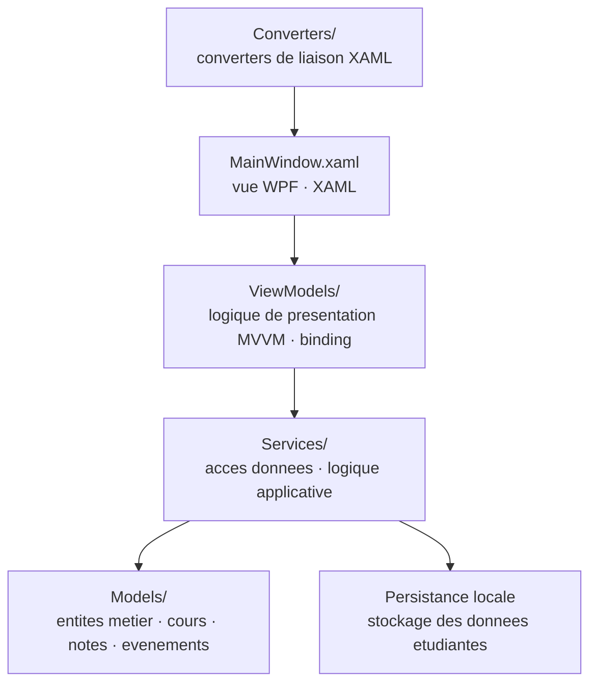

# EtudiantOS

<!-- adam-badges:start -->
[](https://github.com/Adam-Blf/EtudiantOS/commits) [](https://hits.sh/github.com/Adam-Blf/EtudiantOS/) [](https://github.com/Adam-Blf/EtudiantOS/commits) [](https://github.com/Adam-Blf/EtudiantOS) [](LICENSE)
<!-- adam-badges:end -->


Application de bureau Windows pour la gestion de la vie etudiante. Interface WPF MVVM avec suivi des cours, notes, absences et emploi du temps.

## Architecture



## Stack

- C# .NET (WPF, XAML)
- Pattern MVVM (Models / ViewModels / Services / Converters)
- Architecture par couches, persistance locale

## Structure

- `Models/` · entites metier (cours, notes, evenements)
- `ViewModels/` · logique de presentation MVVM
- `Services/` · acces donnees et logique applicative
- `Converters/` · converters XAML
- `MainWindow.xaml` · fenetre principale de l'app

## Lancement

```bash
git clone https://github.com/Adam-Blf/EtudiantOS
cd EtudiantOS
dotnet restore
dotnet run
```

Ou ouvrir `EtudiantOS.csproj` dans Visual Studio puis F5.

## Prerequis

- .NET SDK compatible WPF (Windows uniquement)
- Visual Studio 2022 ou VS Code + extension C#

## Licence

MIT

---

<p align="center">
  <sub>Par <a href="https://adam.beloucif.com">Adam Beloucif</a> · Data Engineer & Fullstack Developer · <a href="https://github.com/Adam-Blf">GitHub</a> · <a href="https://www.linkedin.com/in/adambeloucif/">LinkedIn</a></sub>
</p>


## Star History

<a href="https://www.star-history.com/?repos=Adam-Blf%2FEtudiantOS&type=date&legend=top-left">
 <picture>
   <source media="(prefers-color-scheme: dark)" srcset="https://api.star-history.com/chart?repos=Adam-Blf/EtudiantOS&type=date&theme=dark&legend=top-left" />
   <source media="(prefers-color-scheme: light)" srcset="https://api.star-history.com/chart?repos=Adam-Blf/EtudiantOS&type=date&legend=top-left" />
   
 </picture>
</a>
